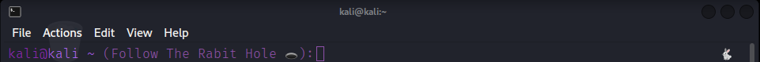

# AliceInWonderLand-Theme
Taking the "Alice in Wonderland" vibe and putting it in your ZSH theme

<h1>Install using Git</h4>

If you are a git user, you can install the theme and keep up to date by cloning the repo:

<button aria-label="Copy to clipboard" class="CodeSnippet_copyButton__Pgg_P">
<svg width="16" height="16" viewBox="0 0 16 16" fill="none" stroke="currentColor" stroke-width="1.5" stroke-linecap="round" stroke-linejoin="round" class="CodeSnippet_clippy__oBwdP" style="stroke-dashoffset:0"><path d="M5.75 4.75H10.25V1.75H5.75V4.75Z"></path><path d="M3.25 2.88379C2.9511 3.05669 2.75 3.37987 2.75 3.75001V13.25C2.75 13.8023 3.19772 14.25 3.75 14.25H12.25C12.8023 14.25 13.25 13.8023 13.25 13.25V3.75001C13.25 3.37987 13.0489 3.05669 12.75 2.88379"></path></svg><svg width="16" height="16" viewBox="0 0 16 16" fill="none" stroke="currentColor" stroke-width="1.5" stroke-linecap="round" stroke-linejoin="round" class="CodeSnippet_check___TMH2" style="stroke-dashoffset:-50"><path d="M13.25 4.75L6 12L2.75 8.75"></path></svg>
</button>
<pre><code>git clone https://github.com/PuggosTheDuck/AliceInWonderLand.git
</code></pre>

<h1>Install manually</h4>
<ol>
<li>Download using the <a href="https://github.com/PuggosTheDuck/AliceInWonderLand-Theme/archive/master.zip">GitHub .zip download</a> option and unzip them.</li>
<li>Move <code>AliceInWonderLand.zsh-theme</code> file to <a href="https://github.com/robbyrussell/oh-my-zsh/">oh-my-zsh</a>&#x27;s theme folder: <code>oh-my-zsh/themes/AliceInWonderLand.zsh-theme</code>.</li>
<li>Move <code>/lib</code> to <a href="https://github.com/robbyrussell/oh-my-zsh/">oh-my-zsh</a>&#x27;s theme folder: <code>oh-my-zsh/themes/lib</code>.</li>
</ol>
<h1>Activating theme</h4>

Go to your <code>~/.zshrc</code> file and set <code>ZSH_THEME=&quot;AliceInWonderLand&quot;</code>.

